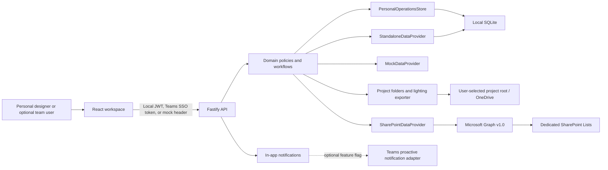

# Architecture

## System shape

The application is a TypeScript pnpm workspace with one browser application and one API. Local development runs Vite on port 5173 and Fastify on port 3001; Vite proxies `/api`. The production Fastify process serves the compiled SPA and API from one HTTPS origin suitable for a Teams personal tab.

The primary 2.0 runtime is the single-user Electron portable application. Electron starts the API on a free loopback port, opens the same React UI, and keeps its SQLite database beside the portable executable. Project documents live under the user-selected project root rather than inside the application database.

## Dependency boundaries

`packages/domain` is framework-free. It owns roles, statuses, authorization policies, record access, status transitions, project-code formatting, workload calculations, report aggregation, provider ports, and typed domain errors.

`packages/contracts` depends on the domain enums and owns Zod schemas at API trust boundaries. `apps/api` applies authentication and route-level authorization before invoking `ProjectService`. `apps/web` never imports server credentials or Graph libraries.

## Request and identity flow

In standalone mode, credentials are verified against salted scrypt hashes in SQLite and the API signs a short-lived HS256 bearer session. Each request resolves the current active user and current server-side role, so deactivation and role changes take effect without trusting the browser. In mock mode the API resolves the actor from `x-mock-user-id`, defaulting to the seeded Line Manager. In Microsoft 365 mode the browser obtains a token with TeamsJS `authentication.getAuthToken()`. The API validates signature, issuer, audience, and lifetime using the tenant OpenID keys, reads the token's `oid`, then resolves the active role from `SCLI_AppUsers`. Teams context and client-submitted roles are never authorization evidence.

Every sensitive list/get/mutation operation applies a domain policy. Sales results are filtered to owned projects; Lighting Designer results include primary and collaborator assignments; only Line Manager/Admin can change a project team; only Admin can mutate users and settings. The Sales Owner, primary Lighting Designer, and collaborators can edit shared project content. Completed/Cancelled content is locked until an allowed transition reopens the record.

## Persistence and consistency

Standalone mode persists users, projects, immutable activities, comments, in-app notifications, settings, idempotency keys, and the project sequence in one SQLite file. It is intentionally single-process and suitable for a small internal team. Mock mode clones deterministic in-memory data and serializes sequence allocation. SharePoint mode maps fields in one adapter and follows `@odata.nextLink` pagination.

Every project carries a monotonically increasing `version`. Shared edits can send `expectedVersion`; stale requests receive a typed `409 CONFLICT` instead of overwriting a colleague's newer changes.

Team time tracking is event-sourced through the same immutable project activity port. Start, pause,
resume, stop, correction, submission, approval, and return actions append validated events; the API
derives the current timer and timesheet state from those events. This preserves the existing local,
standalone, and SharePoint adapter boundary without trusting browser time or introducing mutable audit
records. Only an assigned primary/collaborating Lighting Designer can track time, only one timer can
be active or paused for that designer, and only Line Manager/Admin can approve or return a submitted
timesheet. Sales receives project totals without designer entry details.

Personal operations use additive SQLite tables for requirements, service-driven checklists, actions, local meetings, comments/reviews, revisions, documents, contacts, activity, revision packages, folder-file metadata indexes, and backup history. Schema migration of a populated database creates a timestamped SQLite backup before mutation. Revision issue history and activity are append-oriented; UI workflows supersede records rather than destructively replacing history. Legacy communication tables are retained only so existing databases can be upgraded non-destructively; the personal application exposes no email or calendar connector.

Schema version 11 adds `luminaire_asset_versions` as the immutable authority for Luminaire
Datasheets and Product Images. Each attachment receives an independent, monotonically increasing
version sequence within its Luminaire and asset type. The existing `datasheet_path` and `image_path`
columns remain current-file compatibility projections; changing or clearing one does not delete
historical versions. The additive v10-to-v11 migration creates one truthful v1 snapshot for each
non-empty compatibility path and does not fabricate older history. These observed legacy snapshots
persist `backfilled = true`, use the migration observation time (never a Luminaire update time or
filesystem time), and retain a null actor because the original attachment event and person are
unknown. Canonical server-created versions persist `backfilled = false` with the real attachment
time and authenticated actor snapshot. Provenance is server-owned and is not accepted from client
input. Attachments are validated and written transactionally with the compatibility projection,
actor snapshot, and UTC timestamp. A version is presented as current only when it is the version
resolved by that compatibility projection; clearing the projection leaves history intact with no
historical row falsely marked current.

Schema version 12 (V4-ISSUE-A0) adds the Issue Record Audit authority. Every canonical Issue
Package and its `revision_packages` compatibility projection now persist `issued_by_id`,
`issued_by_name`, and `issued_at` as nullable, immutable Issue-audit columns. For a package
created with business status `Issued`, the server derives the actor snapshot from the
authenticated request and captures ONE server timestamp at the Issue operation; the same logical
values flow through the canonical record, the read projection, and the package manifest — never
independent `now()` calls that could drift. Draft packages persist nulls and their manifests do
not claim an Issue event. `FAILED_RECOVERABLE` retry preserves the original Issue audit (recovery
is technical completion of the same Issue operation, never a new Issue event), while a reissue is
a new immutable package identity with its own new Issue audit values. Pre-migration rows keep
nulls: no historical timestamp is fabricated from `created_at`/`finalized_at` and no actor is
guessed. The additive 11-to-12 migration adds the columns with no default and no backfill.

Schema version 4 provisions the canonical output-provenance graph as separate additive tables:
`canonical_revisions` owns the server-allocated project sequence and immutable Project/Luminaire
snapshot; `canonical_outputs` stores row-based artifacts and the exact resolved Template snapshot;
`canonical_issue_packages` points to one Revision; and `canonical_package_outputs` relates package
and Output UUIDs with same-Revision foreign keys. New artifact locators are project-relative, so a
Project Code/root rename does not change identity. Logical Templates, immutable Template Versions,
global defaults, and per-project overrides are first-class relational records. Template definitions
and historical resolved snapshots are fingerprinted; an issued Output is read from its stored
snapshot and is never reconstructed from current defaults or an inactive Template Version.

Schema version 19 adds two nullable fields to `canonical_revisions` without changing Revision
identity or finalization eligibility. `purpose` is concise contextual metadata available to the
Revision workspace and Purpose-only Package/Issue History application views. `internal_note` is
Revision-workspace-only working information and is never projected into Package/Issue History DTOs
or client package materialization. Both normalize surrounding whitespace and blank input to NULL;
the serialized metadata mutation re-checks the exact Project UUID, Revision UUID, canonical
provenance, and PREPARING lifecycle at write time. Historical rows remain NULL, and compatibility
`summary`/`changeLog` values are not treated as canonical metadata authority.

Schema version 20 is the Phase 4A integration boundary. It adds nullable immutable Revision and
source-Document UUID snapshots to `tool_contexts`, a nullable immutable Revision UUID snapshot to
`capture_ledger`, and a bounded routing-decision audit tuple. Historical rows remain NULL. The
snapshot fields deliberately have no foreign keys, so later Revision deletion/sequence reuse or
Document lifecycle cannot erase or silently rebind historical identity. `routing_decision` accepts
only `AUTO_APPROVED`, `USER_CONFIRMED`, or `REJECTED`; user confirmation requires durable decision
time and actor ID/name snapshots. This foundation does not implement file watching, naming,
destination routing, or Revision composition changes.

Schema version 21 is the bounded P4D output-presentation extension. It adds
`DatasheetRegister` to the existing constrained Template/default/override/Output family and
registers immutable professional Template Versions. It does not change Project, Revision, Package,
Document, Managed Artifact, delete, or sequence-reuse identity authority.

Professional outputs use one repository-owned pipeline:

`Project or exact Revision data -> immutable resolved output envelope -> bounded Template Version and resolved options -> V4 Preview pages -> PDF/XLSX serializer -> canonical Output registration`.

Preview is transient and allocates no document identity. Generate re-resolves authority and
requires the Preview SHA-256 fingerprint. PDF uses the same page model shown in Preview. XLSX
guarantees the same resolved rows, UUID identity, ordering, metadata, and print settings; browser
Preview does not claim pixel equality with an installed Excel engine. Every final Output stores its
Template ID/version, resolved Template snapshot, renderer/layout identity, source fingerprint,
format, and exact source Revision UUID. These internal canonical Outputs do not enter the Phase-4
managed-capture pipeline.

The pre-v4 `project_revisions`, `project_exports`, and `revision_packages` tables remain preserved
compatibility/read-history sources. Their numeric matches and absolute paths are not canonical
identity. The v4 migration imports only source-proven links as `LEGACY_VERIFIED`; ambiguous
relationships and all unknown legacy Template provenance remain explicitly unverified. Production
startup now activates `CanonicalOutputRegistryStore` explicitly in `CANONICAL` mode. New Schedule,
BOQ, manual Revision-register, and Issue Package writes reserve their UUID and server-owned sequence
through that authority. Compatibility rows are derived from the canonical UUID/sequence only; the
legacy allocators remain available solely to non-canonical test/compatibility assembly and existing
history reads. There is no active production dual-write authority.

Canonical generation uses a recoverable SQLite/filesystem state machine rather than claiming a
cross-resource transaction. The exact order is: reserve one Revision as `PREPARING`, snapshot the
Project and Luminaire UUIDs/exact Tags, resolve Templates, reserve all expected Output UUIDs as
`PREPARING`, render into owned scratch space, copy to deterministic per-Output temporary paths,
persist and verify SHA-256, perform a collision-protected same-volume rename, then finalize each
Output. The compatibility projection is written from those canonical identities before the
Revision becomes `FINALIZED`. Partial failures retain successful Output truth and mark the remaining
Output/Revision identities `FAILED_RECOVERABLE`; explicit retry reuses those identities and stored
snapshots rather than allocating or re-resolving them.

Startup reconciliation reads only canonical rows and their exact project-relative locators. A
`PREPARING` Output is finalized only when the final file and persisted hash prove completion;
otherwise it becomes recoverable. Aggregate Revision completion remains conservative and requires
an explicit identity-preserving retry, because Output files alone cannot prove that all derived
read-model work completed. Missing or changed artifacts for already-finalized history are reported
without rewriting history. Exact UUID-derived temp paths are reported and left untouched; no folder
scan, wildcard deletion, or speculative cleanup is performed. Issue Packages follow the same
reserve/build/validate/finalize pattern, select only finalized hashed Output UUIDs from one Revision,
and embed canonical UUIDs, relative locators, and hashes in their manifest.

Existing-project onboarding scans only the direct child folder names during preview. Optional inventory scanning walks the selected folder tree with depth and file-count limits, ignores temporary/system/link entries, and reads names, sizes, timestamps, and extensions without opening file contents. OneDrive-managed paths are labeled explicitly because opening an online-only result later may hydrate it. Import links the original path in place, preserves the exact legacy project code, defaults to historical/archive status, advances the future project-number floor, and excludes the import audit from activity-period totals. Archive and Remove from App mutate local records only; filesystem deletion is not part of either workflow.

Project-number allocation reads the dedicated sequence item, captures its ETag, increments `LastNumber`, and PATCHes with `If-Match`. A `412` causes a bounded jittered re-read/retry. Uniqueness is mandatory; sequence gaps are allowed.

SharePoint has no cross-list transaction covering project, activities, and notifications. The project record carries an idempotency key. If an audit or notification side effect fails after the project is saved, the API returns a typed reconciliation error with the project ID; operations documentation must reconcile the missing immutable side effect instead of retrying blindly.

## Startup safety (P1.8B)

Standalone startup is protected by a database-scoped cross-process startup lock and a
`WorkspaceStartupCoordinator` core. The lock is OS/SQLite-held, not PID-marker trust: it is a
live `BEGIN EXCLUSIVE` transaction on a dedicated sibling SQLite lock database, so a crashed
owner releases the lock automatically when the OS closes its handles. Lock identity is derived
from the canonical real parent directory plus the Windows-normalized database filename and
hashed with SHA-256, so path casing, `.`/`..` segments, separator variants, and parent-directory
junction aliases map to one lock, while an atomic restore replacement of the target database
file does not change the lock path. The persistent lock database file may remain after release;
its existence is not proof that the lock is held.

The coordinator runs, in order: lock acquisition, the injected pending-restore gate, a read-only
interrupted-attempt gate, the schema migration runner, and then the standalone provider and
personal store factories. Provider and store factories never run when the lock is unavailable,
restore fails, recovery is required, migration fails, or migration post-validation fails. The
interrupted-attempt gate uses the existing journal public APIs and never applies automatic
reconciliation and never writes a resolution sidecar; unresolved, corrupt, or stale states
return `RECOVERY_REQUIRED` with `manualActionRequired=true`. The coordinator owns the runtime
resources it opens: `shutdown()` closes the personal store, then the provider, then releases the
lock, and attempts every cleanup step even if an earlier step fails.

Production startup is wired to this core for the supported Personal runtimes. Both supported
production Personal entrypoints resolve to ONE canonical bootstrap
(`createPersonalProductionServer` in `apps/api/src/infrastructure/startup/`):

- the Electron/desktop portable app spawns `dist/personal-server.js`, which delegates to the
  shared canonical Personal production server.
- the documented standalone production command `pnpm start` (`node dist/server.js`) routes
  `APP_MODE=standalone` + `WORKSPACE_VARIANT=personal` + `NODE_ENV=production` to that same
  shared canonical Personal production server. The generic `server.ts` assembly remains only for
  mock/test/team/Microsoft 365 and non-production harnesses.

The shared Personal production bootstrap always requests an explicit CANONICAL authority (the
`CanonicalOutputRegistryStore` default remains `LEGACY_COMPATIBILITY` for non-production callers)
and fails closed at assembly if a CANONICAL registry is not present, so no supported production
Personal runtime can silently fall back to the independent legacy Revision/Export/Package writers.
The generic `createApp` legacy fallback remains available only to explicit test/legacy fixtures and
the team/Microsoft 365 runtimes.

Cross-process safety applies only to processes using this lock implementation, and the Electron
window lock remains a separate UX lock.

## Frontend architecture

The React application uses BrowserRouter, TanStack Query, React Hook Form, Zod, Motion, Recharts and locally bundled fonts. Feature screens are lazy-loaded. Role-based navigation is a usability layer; the API remains the security boundary. Team navigation and the Today page are intentionally role-specific. Project intake uses lighting templates with a short required section and collapsible technical details. Project filters have fixed role-aware quick views plus optional device-local saved views; saved views contain only query parameters and are not authorization rules.

Project board status changes use optimistic cache updates, snapshot rollback on server rejection, and a native select as a keyboard alternative to drag-and-drop. Charts have equivalent data tables. Motion is removed for users who prefer reduced motion.

## Runtime modes

- `mock`: deterministic data, visible user switcher, no tenant, guarded E2E reset route.
- `standalone` (default): local accounts and persistent SQLite; no Microsoft tenant dependency.
- `m365`: fail-closed token authentication and SharePoint provider. Missing values appear through the safe integration-status endpoint and never trigger a silent mock fallback.

## Production boundaries not exercised locally

The implementation includes Entra token validation, Graph list access, ETag retry, Teams manifest/SSO configuration and an isolated proactive-notification adapter. Live tenant consent, site grants, Teams upload, bot installation/conversation persistence, network policy and hosting are environment responsibilities and were not tested by mock-mode validation.

# Phase 4B capture routing

The Personal production API owns the Phase 4B capture pipeline. `CaptureInboxCoordinator` detects only direct files in exact Tool Context inboxes; `CaptureRoutingCoordinator` orchestrates the existing capture ledger; policy, destination, naming, filing, persistence, and read-model services retain separate authorities. See [phase-4b-capture-routing.md](./phase-4b-capture-routing.md).

## Phase 5B-A persistent Smart Import inspection

Schema v24 adds `import_sessions`, `import_source_tables`, `import_rows`, and the reserved
`import_apply_attempts` lineage table. An Import Session UUID is the durable inspection identity;
the source path, filename, Project Code, worksheet name, and Tag are not identities. Tables retain
header/mapping decisions and rows retain source cells, normalization evidence, and validation
reasons so History can reopen after process restart without the original file.

Source admission is server-owned. Browser uploads and the typed Desktop file-picker handoff both
converge on `ImportInspectionService`; the server checks extension and size, stages with exclusive
creation, computes SHA-256, parses through the adapter registry, persists one transaction, and then
deletes the transient source bytes. CSV/TSV and XLSX adapters may inspect only bounded in-memory
bytes. XLSX inspection does not evaluate formulas, execute macros, fetch links, or dereference
workbook paths. Raw cell values remain immutable evidence; normalized candidates are a separate
derived layer.

Phase 5B-A is inspection-only. It creates no Project luminaires, Library drafts, assets, files,
revisions, or apply operations. `import_apply_attempts` is structural reservation only and there is
no Apply API or enabled Apply control. Phase 5B-B must own reconciliation/apply semantics and the
known canonical-Tag write-casing correction. PDF/ZIP/image/datasheet extraction and OCR remain a
Phase 5C boundary; no sibling-folder scan exists.

## Phase 5C document intelligence

Schema v26 adds immutable PDF source/version identity, durable processing attempts, source-backed
values, proposed relationships, quality findings, append-only Owner decisions, and governed routing
proposals. Local extraction and bundled offline OCR sit behind infrastructure adapters; domain
authority remains classification/association/review lifecycle and never mutates canonical Revision
identity. See [phase-5c-document-intelligence.md](./phase-5c-document-intelligence.md).
