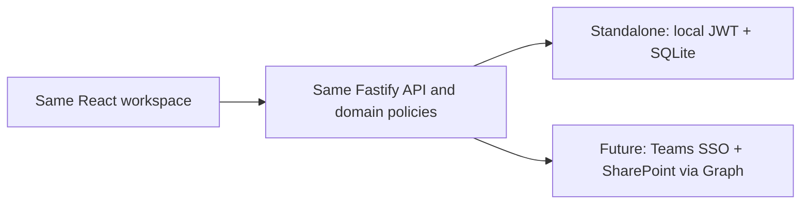

# Standalone deployment

## The no-IT boundary

`APP_MODE=standalone` is the current operating mode. It runs in a normal browser with local application accounts and SQLite. It has no dependency on Microsoft Teams, Entra ID, SharePoint, Microsoft Graph, a bot, tenant consent, or an app catalog.

Running it on one employee's computer for that employee requires no tenant work. Sharing it with the wider team requires an always-on host that the team can reach. A local network address may be enough for an approved internal pilot; an HTTPS hostname, firewall rule, backups, and machine availability may still be governed by company policy. Embedding the app inside Teams is optional and can require tenant upload permission even though the app itself remains standalone.

## Initial setup

1. Install Node.js 24 and pnpm 11.9 on the chosen host.
2. Clone/copy the repository and run `pnpm install --frozen-lockfile`.
3. Copy `.env.example` to the ignored `.env` file.
4. Keep `APP_MODE=standalone` and set a unique session secret, bootstrap Admin email, and bootstrap Admin password.
5. For a single production process, set `NODE_ENV=production` and set `WEB_ORIGIN` to the exact URL users will open.
6. Run `pnpm build`, then `pnpm start`.
7. Sign in as the bootstrap Admin and create the real team accounts in **Settings → Users & roles**.

`pnpm start` resolves to the shared **canonical Personal production bootstrap** (the same assembly
the desktop portable app uses). With `APP_MODE=standalone`, `WORKSPACE_VARIANT=personal`, and
`NODE_ENV=production`, the server runs the registered schema migration chain to version 21 and
validates the exact final v21 structure before serving requests. It uses the
`CanonicalOutputRegistryStore` in explicit **CANONICAL** authority mode with the canonical
generation and Issue Package services. A supported production Personal runtime must never silently
fall back to the independent legacy Revision/Export/Package writers; if the canonical registry is
not present, startup fails closed rather than constructing a legacy-writer runtime. The generic
assembly that retains the legacy-capable `createApp` fallback is used only by the team/Microsoft 365
runtimes and non-production test harnesses.

The bootstrap values are only used when a brand-new database is initialized. Changing `STANDALONE_ADMIN_PASSWORD` after the database exists does not overwrite the current Admin password; use the in-app reset action for an existing account.

The late v16-v21 contract is fail-closed and read-only outside the registered migration
transactions. Startup verifies the complete owned structural fingerprint, SQLite integrity,
foreign-key integrity, Revision-number reuse provenance, and automation routing-decision
provenance. It refuses partial or modified
versioned structures; it does not fabricate migration history, repair schema, derive historical
file hashes, restore a backup automatically, or backfill automation bindings. See
[Phase 4A integration foundation](phase-4a-integration-foundation.md).

## Storage and recovery

The database path defaults to `data/scli.sqlite`. SQLite may also create `scli.sqlite-wal` and `scli.sqlite-shm` while the process is running.

- Store `data` on a local, reliable disk—not a consumer sync folder.
- Stop the application before making a simple file copy, then copy all SQLite files together.
- Keep encrypted, access-controlled backups outside the host and test a restore on a separate machine.
- Run only one API process against this database. The standalone adapter is designed for a small internal team, not a multi-instance cluster.
- Monitor disk space and the API health endpoint at `/api/health`.

To restore, use the verified restore workflow described by the migration recovery documentation.
Restore is always an explicit operator action; a migration failure retains its verified backup but
does not replace the active database automatically. Verify login, project counts, and recent audit
entries before reopening access.

For schema v26, keep `document-store/objects` on the same protected Personal data volume as the
SQLite database. Verified backups include these immutable PDF objects and their hash manifest.
After restore, verify schema v26, `PRAGMA foreign_key_check`, managed-object presence and SHA-256,
then reopen the Document Review Center. Do not copy only the SQLite file and omit the document
store. Production API packaging must also pass `pnpm ocr:package-smoke` and
`pnpm ocr:runtime-smoke`; missing or network-dependent OCR assets block deployment.

## Account operations

- Only an Admin can create, edit, deactivate, or reset local accounts.
- A deactivated account cannot sign in and existing bearer sessions are rejected on their next API request.
- Passwords are salted and hashed with scrypt; plaintext passwords are never stored.
- Password resets do not display or email a password. The Admin must share the temporary password through an approved channel.
- A user name change updates the account. Existing project/audit name snapshots remain unchanged so historical records keep their original meaning.

## Future Microsoft 365 upgrade

The application keeps Microsoft-specific concerns at the outer adapter layer:

The future change is primarily deployment and migration work:

1. Provision Entra/Teams registrations and a dedicated SharePoint site with `Sites.Selected`.
2. Provision the documented lists and grant the application access to that site.
3. Migrate users and project records while preserving internal UUIDs and audit timestamps.
4. Set `APP_MODE=m365` and the validated environment values.
5. Run tenant-specific SSO, record-access, Graph, packaging, and Teams installation tests.

Do not point a production instance at Microsoft 365 until those tenant tests and the data migration/reconciliation plan are approved.
